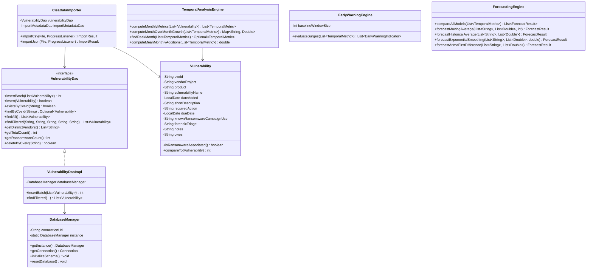
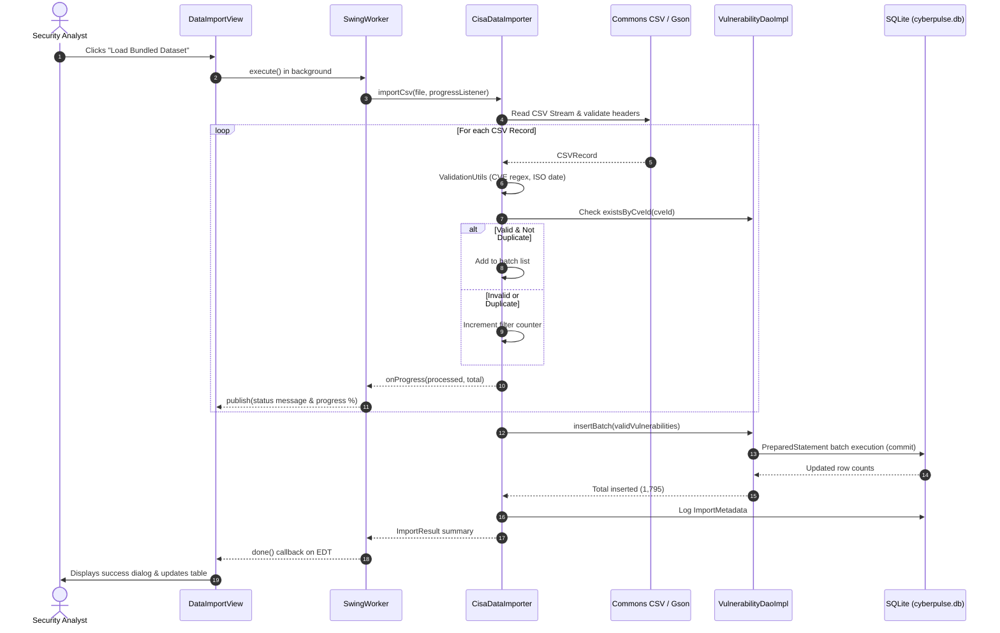

# UML Design Diagrams & System Specifications

## 1. UML Class Diagram

```mermaid
classDiagram
    class Vulnerability {
        -String cveId
        -String vendorProject
        -String product
        -String vulnerabilityName
        -LocalDate dateAdded
        -String shortDescription
        -String requiredAction
        -LocalDate dueDate
        -String knownRansomwareCampaignUse
        -String forensicTriage
        -String notes
        -String cwes
        +isRansomwareAssociated() boolean
        +compareTo(Vulnerability) int
    }

    class VulnerabilityDao {
        <<interface>>
        +insertBatch(List~Vulnerability~) int
        +insert(Vulnerability) boolean
        +existsByCveId(String) boolean
        +findByCveId(String) Optional~Vulnerability~
        +findAll() List~Vulnerability~
        +findFiltered(String, String, String, String, String) List~Vulnerability~
        +getDistinctVendors() List~String~
        +getTotalCount() int
        +getRansomwareCount() int
        +deleteByCveId(String) boolean
    }

    class VulnerabilityDaoImpl {
        -DatabaseManager databaseManager
        +insertBatch(List~Vulnerability~) int
        +findFiltered(...) List~Vulnerability~
    }

    class DatabaseManager {
        -String connectionUrl
        -static DatabaseManager instance
        +getInstance() DatabaseManager
        +getConnection() Connection
        +initializeSchema() void
        +resetDatabase() void
    }

    class CisaDataImporter {
        -VulnerabilityDao vulnerabilityDao
        -ImportMetadataDao importMetadataDao
        +importCsv(File, ProgressListener) ImportResult
        +importJson(File, ProgressListener) ImportResult
    }

    class TemporalAnalysisEngine {
        +computeMonthlyMetrics(List~Vulnerability~) List~TemporalMetric~
        +computeMonthOverMonthGrowth(List~TemporalMetric~) Map~String, Double~
        +findPeakMonth(List~TemporalMetric~) Optional~TemporalMetric~
        +computeMeanMonthlyAdditions(List~TemporalMetric~) double
    }

    class EarlyWarningEngine {
        -int baselineWindowSize
        +evaluateSurges(List~TemporalMetric~) List~EarlyWarningIndicator~
    }

    class ForecastingEngine {
        +compareAllModels(List~TemporalMetric~) List~ForecastResult~
        +forecastMovingAverage(List~String~, List~Double~, int) ForecastResult
        +forecastHistoricalAverage(List~String~, List~Double~) ForecastResult
        +forecastExponentialSmoothing(List~String~, List~Double~, double) ForecastResult
        +forecastArimaFirstDifference(List~String~, List~Double~) ForecastResult
    }

    VulnerabilityDao <|.. VulnerabilityDaoImpl
    VulnerabilityDaoImpl --> DatabaseManager
    CisaDataImporter --> VulnerabilityDao
    CisaDataImporter --> Vulnerability
    TemporalAnalysisEngine --> Vulnerability
```

---

## 2. Sequence Diagram: Data Ingestion & Auto-Seeding Workflow

```mermaid
sequenceDiagram
    autonumber
    actor User as Security Analyst
    participant UI as DataImportView
    participant Worker as SwingWorker
    participant Importer as CisaDataImporter
    participant Parser as Commons CSV / Gson
    participant DAO as VulnerabilityDaoImpl
    participant DB as SQLite (cyberpulse.db)

    User->>UI: Clicks "Load Bundled Dataset"
    UI->>Worker: execute() in background
    Worker->>Importer: importCsv(file, progressListener)
    Importer->>Parser: Read CSV Stream & validate headers
    loop For each CSV Record
        Parser-->>Importer: CSVRecord
        Importer->>Importer: ValidationUtils (CVE regex, ISO date)
        Importer->>DAO: Check existsByCveId(cveId)
        alt Valid & Not Duplicate
            Importer->>Importer: Add to batch list
        else Invalid or Duplicate
            Importer->>Importer: Increment filter counter
        end
        Importer-->>Worker: onProgress(processed, total)
        Worker-->>UI: publish(status message & progress %)
    end
    Importer->>DAO: insertBatch(validVulnerabilities)
    DAO->>DB: PreparedStatement batch execution (commit)
    DB-->>DAO: Updated row counts
    DAO-->>Importer: Total inserted (1,795)
    Importer->>DB: Log ImportMetadata
    Importer-->>Worker: ImportResult summary
    Worker-->>UI: done() callback on EDT
    UI->>User: Displays success dialog & updates table
```
